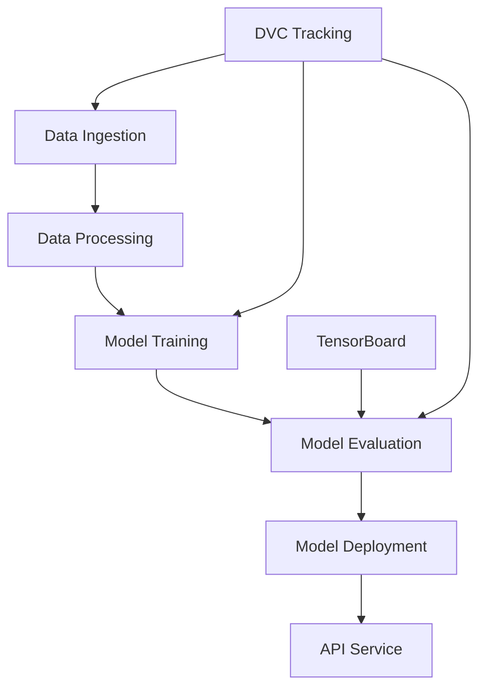

# 🔫 Guns Object Detection System - MLOPs

A comprehensive Machine Learning Operations (MLOPs) pipeline for detecting guns in images using PyTorch and Faster R-CNN architecture. This project implements an end-to-end production-ready pipeline from data ingestion to model deployment with proper logging, exception handling, experiment tracking, and a FastAPI web service for real-time inference.

## 🎯 Project Overview

This project builds a robust object detection system specifically designed to identify guns in images for security and safety applications. It leverages the state-of-the-art Faster R-CNN architecture with ResNet-50 backbone and implements comprehensive MLOPs best practices including:

- **Automated Data Pipeline**
- **Modular Architecture**
- **Advanced Logging & Monitoring**
- **Experiment Tracking**
- **Data Version Control**
- **Production Deployment**
- **GPU Acceleration**
  
## 🚀 Key Features

### 🎯 Core Functionality
- **Advanced Object Detection**: State-of-the-art Faster R-CNN with ResNet-50 backbone for accurate gun detection
- **Real-time Inference**: FastAPI-based REST API service for instant prediction on uploaded images
- **Production-Ready Pipeline**: Complete MLOPs workflow from data ingestion to model deployment
- **Batch Processing**: Support for processing multiple images with confidence-based filtering

### 🛠️ MLOPs Infrastructure
- **Automated Data Management**: Intelligent data ingestion from Kaggle with organized storage structure
- **Experiment Tracking**: TensorBoard integration for comprehensive training monitoring and visualization
- **Pipeline Orchestration**: DVC-based reproducible ML pipelines with dependency management
- **Model Versioning**: Automated model artifact management and versioning
- **Logging & Monitoring**: Multi-level logging with daily log rotation and error tracking

### 🔧 Technical Features
- **GPU Acceleration**: Automatic CUDA detection and utilization for optimal performance
- **Custom Dataset Processing**: Specialized dataset class for gun detection with label parsing
- **Modular Architecture**: Clean separation of concerns with reusable components
- **Error Handling**: Comprehensive custom exception system with detailed error reporting
- **Configuration Management**: Centralized configuration system for easy parameter tuning
- **Memory Optimization**: Efficient data loading and processing for large datasets

## 📋 Requirements

### System Requirements
- **Operating System**: Linux (Ubuntu 18.04+), macOS, or Windows 10+
- **Python Version**: Python 3.8+ (Python 3.9+ recommended)
- **GPU**: CUDA-compatible GPU with 6GB+ VRAM (recommended for training)
- **RAM**: 8GB+ system RAM (16GB+ recommended for large datasets)
- **Storage**: 15GB+ free disk space (dataset + models + logs)
- **Network**: Stable internet connection for data download and package installation

### Core Dependencies

- Python 3.11

Please check the [requirements.txt](requirements.txt) for all the dependencies

## 🛠️ Installation & Setup

### 1. Repository Setup
```bash
# Clone the repository
git clone https://github.com/your-username/Guns-Object-Detection-System-MLOPs.git
cd Guns-Object-Detection-System-MLOPs

# Verify Python version
python --version  # Should be 3.8+
```

### 2. Environment Setup
```bash
# Create and activate virtual environment
python -m venv gun_detection_env
source gun_detection_env/bin/activate  # On Windows: gun_detection_env\Scripts\activate

# Upgrade pip and setuptools
pip install --upgrade pip setuptools wheel
```

### 3. Dependencies Installation
```bash
# Install all required packages
pip install -r requirements.txt

# Install the project in development mode
pip install -e .

# Verify PyTorch installation with CUDA (if available)
python -c "import torch; print(f'PyTorch version: {torch.__version__}'); print(f'CUDA available: {torch.cuda.is_available()}')"
```

### 4. Kaggle API Configuration
```bash
# Create Kaggle directory and copy credentials
mkdir -p ~/.kaggle
cp path/to/your/kaggle.json ~/.kaggle/
chmod 600 ~/.kaggle/kaggle.json

# Test Kaggle API
kaggle datasets list --sort-by downloadCount
```

### 5. Project Structure Verification
```bash
# Verify project structure
python -c "from src.logger import get_logger; print('✅ Logger module working')"
python -c "from src.data_ingestion import DataIngestion; print('✅ Data ingestion module working')"
python -c "import torch; print(f'✅ Device: {torch.device(\"cuda\" if torch.cuda.is_available() else \"cpu\")}')"
```

## 🏗️ Project Architecture

```
Guns-Object-Detection-System-MLOPs/
├── 📁 src/                           # Core source code modules
│   ├── 🐍 __init__.py               # Package initialization
│   ├── 🔍 data_ingestion.py         # Automated Kaggle data download & extraction
│   ├── 🔄 data_processing.py        # Custom dataset class & preprocessing pipeline
│   ├── 🧠 model_architecture.py     # Faster R-CNN model implementation
│   ├── 🚀 model_training.py         # Training pipeline with TensorBoard integration
│   ├── 📝 logger.py                 # Centralized logging configuration
│   └── ⚠️  custom_exception.py      # Custom exception handling system
│
├── 📁 config/                        # Configuration management
│   ├── 🐍 __init__.py               # Configuration package initialization
│   └── ⚙️  data_ingestion_config.py # Data ingestion parameters & settings
│
├── 📁 artifacts/                     # Generated artifacts & data storage
│   ├── 📁 raw/                      # Raw dataset storage
│   │   ├── 📁 Images/               # Training images (300+ gun detection images)
│   │   └── 📁 Labels/               # Corresponding bounding box labels
│   └── 📁 models/                   # Trained model artifacts
│       └── 🧠 fasterrcnn.pth        # Trained Faster R-CNN model weights
│
├── 📁 notebook/                      # Jupyter notebooks for experimentation
│   └── 📊 guns-object-detection.ipynb # Interactive analysis & visualization
│
├── 📁 logs/                          # Application logging
|
├── 📁 tensorboard_logs/              # TensorBoard experiment tracking
|
├── 📁 Guns_Object_Detection.egg-info/ # Package metadata
|
├── 🔧 main.py                        # FastAPI REST API service
├── 🔄 dvc.yaml                       # DVC pipeline configuration
├── 🔒 dvc.lock                       # DVC pipeline lock file
├── 📦 requirements.txt               # Python dependencies
├── 🛠️  setup.py                      # Package installation script
└── 📚 README.md                      # Comprehensive project documentation
```

### 📋 Module Descriptions

#### Core Modules (`src/`)
- **`data_ingestion.py`**: Handles automated dataset download from Kaggle, file extraction, and directory organization
- **`data_processing.py`**: Implements `GunDataset` class with custom data loading, image preprocessing, and label parsing
- **`model_architecture.py`**: Defines `FasterRCNNModel` class with ResNet-50 backbone and custom prediction head
- **`model_training.py`**: Orchestrates the complete training pipeline with validation, TensorBoard logging, and model saving
- **`logger.py`**: Provides centralized logging configuration with daily file rotation and structured formatting
- **`custom_exception.py`**: Implements detailed exception handling with file names and line numbers for debugging

#### Configuration (`config/`)
- **`data_ingestion_config.py`**: Centralized configuration for dataset parameters and directory paths

#### API Service (`main.py`)
- **FastAPI Application**: Production-ready REST API for real-time gun detection inference
- **Image Processing**: Handles image upload, preprocessing, prediction, and result visualization
- **Response Handling**: Returns processed images with bounding boxes and confidence scores

## 🔄 MLOPs Pipeline Workflow

The project implements a comprehensive MLOPs pipeline using DVC for reproducible machine learning workflows:

### 📊 Pipeline Overview


### 🚀 Pipeline Stages

#### Stage 1: Data Ingestion
```bash
# Execute data ingestion pipeline
dvc repro data_ingestion

# Manual execution
python src/data_ingestion.py
```

**What it does:**
- Downloads gun detection dataset from Kaggle (`issaisasank/guns-object-detection`)
- Extracts and organizes images and labels into structured directories
- Creates artifact storage structure (`artifacts/raw/Images/` and `artifacts/raw/Labels/`)
- Validates data integrity and logs progress
- Handles ZIP file extraction and directory management

**Dependencies:** `src/data_ingestion.py`, Kaggle API credentials
**Outputs:** `artifacts/raw/Images/`, `artifacts/raw/Labels/`

#### Stage 2: Model Training
```bash
# Execute training pipeline
dvc repro model_training

# Manual execution with custom parameters
python src/model_training.py
```

**What it does:**
- Loads and preprocesses the gun detection dataset
- Initializes Faster R-CNN model with ResNet-50 backbone
- Implements train-validation split (80-20 ratio)
- Executes training loop with TensorBoard logging
- Saves trained model weights to `artifacts/models/fasterrcnn.pth`
- Tracks training metrics and loss curves

**Dependencies:** `src/model_training.py`, `artifacts/raw/Images/`, `artifacts/raw/Labels/`
**Outputs:** `artifacts/models/fasterrcnn.pth`, TensorBoard logs

#### Stage 3: Complete Pipeline Execution
```bash
# Run entire pipeline
dvc repro

# Force re-execution of all stages
dvc repro --force

# Check pipeline status
dvc status
```

### 🔍 Pipeline Monitoring

#### TensorBoard Tracking
```bash
# Launch TensorBoard for experiment monitoring
tensorboard --logdir=tensorboard_logs --port=6006

# View specific experiment
tensorboard --logdir=tensorboard_logs/20250613-183804
```

**Available Metrics:**
- Training loss per epoch
- Validation loss curves
- Learning rate scheduling
- Model performance metrics

#### DVC Status & Metrics
```bash
# Check pipeline status
dvc status

# View pipeline DAG
dvc dag

# Show metrics and parameters
dvc metrics show
dvc params show
```

## 🎓 Usage Guide

### 🚀 Quick Start

#### 1. Data Preparation
```bash
# Download and prepare dataset
python src/data_ingestion.py

# Verify data structure
ls -la artifacts/raw/Images/ | head -10
ls -la artifacts/raw/Labels/ | head -10
```

#### 2. Model Training
```bash
# Start training with default parameters
python src/model_training.py

# Monitor training progress
tensorboard --logdir=tensorboard_logs --port=6006
# Open http://localhost:6006 in your browser
```

#### 3. API Service Deployment
```bash
# Start FastAPI server for inference
uvicorn main:app --host 0.0.0.0 --port 8000 --reload

# Test API endpoint
curl -X GET "http://localhost:8000/"
# Expected response: {"message": "Welcome to the Guns Object Detection API!"}
```

#### 4. Image Prediction
```bash
# Test prediction via API
curl -X POST "http://localhost:8000/predict/" \
  -H "accept: image/png" \
  -H "Content-Type: multipart/form-data" \
  -F "file=@path/to/your/test_image.jpg"
```

### 🔧 Advanced Usage

#### Custom Training Configuration
```python
from src.model_training import ModelTraining
from src.model_architecture import FasterRCNNModel
import torch

# Configure device
device = torch.device("cuda" if torch.cuda.is_available() else "cpu")
print(f"Using device: {device}")

# Initialize training with custom parameters
training = ModelTraining(
    model_class=FasterRCNNModel,
    num_classes=2,              # Background + Gun
    learning_rate=0.001,        # Adjust based on your needs
    epochs=25,                  # Increase for better convergence
    dataset_path="artifacts/raw/",
    device=device
)

# Start training
training.train()
```

#### Batch Image Processing
```python
from src.model_architecture import FasterRCNNModel
import torch
from torchvision import transforms
from PIL import Image
import os

# Load trained model
device = torch.device("cuda" if torch.cuda.is_available() else "cpu")
model_instance = FasterRCNNModel(num_classes=2, device=device)
model = model_instance.model
model.load_state_dict(torch.load("artifacts/models/fasterrcnn.pth", map_location=device))
model.eval()

# Process multiple images
transform = transforms.Compose([transforms.ToTensor()])
image_dir = "path/to/your/images/"

for image_file in os.listdir(image_dir):
    if image_file.endswith(('.jpg', '.jpeg', '.png')):
        image_path = os.path.join(image_dir, image_file)
        image = Image.open(image_path)
        image_tensor = transform(image).unsqueeze(0).to(device)
        
        with torch.no_grad():
            predictions = model(image_tensor)
            # Process predictions...
```

#### Jupyter Notebook Exploration
```bash
# Launch Jupyter for interactive analysis
jupyter notebook notebook/guns-object-detection.ipynb

# Or use JupyterLab
jupyter lab
```

## 🏛️ Model Architecture & Technical Details

### 🧠 Core Architecture

**Base Model**: Faster R-CNN with ResNet-50 Feature Pyramid Network (FPN)
**Framework**: PyTorch with torchvision pre-trained models
**Pre-training**: COCO dataset pre-trained weights for transfer learning
**Classes**: 2 classes (Background: 0, Gun: 1)
**Input Format**: RGB images of variable dimensions
**Output Format**: Bounding boxes with confidence scores and class labels

### 🔧 Model Components

#### 1. Backbone Network
- **Architecture**: ResNet-50 with Feature Pyramid Network (FPN)
- **Purpose**: Feature extraction from input images
- **Features**: Multi-scale feature maps for improved object detection
- **Pre-training**: ImageNet and COCO pre-trained weights

#### 2. Region Proposal Network (RPN)
- **Function**: Generates object proposals (potential object regions)
- **Anchors**: Multiple scales and aspect ratios for comprehensive coverage
- **Output**: Object/background classification + bounding box regression

#### 3. ROI (Region of Interest) Head
- **Classification Head**: Predicts object class (background vs. gun)
- **Regression Head**: Refines bounding box coordinates
- **ROI Pooling**: Fixed-size feature extraction from variable-sized regions

#### 4. Custom Prediction Head
```python
# Model customization for gun detection
class FasterRCNNModel:
    def create_model(self):
        model = fasterrcnn_resnet50_fpn(pretrained=True)
        in_features = model.roi_heads.box_predictor.cls_score.in_features
        model.roi_heads.box_predictor = FastRCNNPredictor(in_features, self.num_classes)
        return model
```

### 📊 Training Configuration

#### Hyperparameters
- **Learning Rate**: 0.001 (Adam optimizer)
- **Batch Size**: 3 (optimized for GPU memory)
- **Epochs**: Configurable (default: 1 for testing, 25+ for production)
- **Weight Decay**: Default PyTorch settings
- **Momentum**: Adam optimizer built-in momentum

#### Data Augmentation & Preprocessing
- **Normalization**: RGB values normalized to [0, 1] range
- **Tensor Conversion**: PIL Image → PyTorch Tensor
- **Device Management**: Automatic CUDA/CPU allocation
- **Aspect Ratio**: Preserved during preprocessing

#### Loss Functions
- **Classification Loss**: Cross-entropy loss for object classification
- **Regression Loss**: Smooth L1 loss for bounding box regression
- **RPN Loss**: Combined classification and regression losses for region proposals

### 🎯 Performance Metrics

#### Model Specifications
- **Input Size**: Variable (automatically handled by FPN)
- **Output Format**: Dictionary containing:
  - `boxes`: Tensor of bounding box coordinates [x1, y1, x2, y2]
  - `labels`: Tensor of class predictions
  - `scores`: Tensor of confidence scores
- **Inference Threshold**: 0.7 confidence score for final predictions
- **NMS Threshold**: Non-Maximum Suppression for overlapping boxes

#### Training Metrics (Tracked via TensorBoard)
- **Total Loss**: Combined classification and regression losses
- **Training Progress**: Loss curves and convergence monitoring
- **Validation Performance**: Model generalization assessment
- **Learning Rate**: Monitoring for optimal training dynamics

### 🔍 Dataset Specifications

#### Dataset Details
- **Source**: Kaggle dataset `issaisasank/guns-object-detection`
- **Images**: 300+ high-quality images with gun annotations
- **Format**: JPEG images with corresponding text label files
- **Annotations**: Bounding box coordinates in [x1, y1, x2, y2] format
- **Split**: 80% training, 20% validation (configurable)

#### Label Format
```
# Label file structure (*.txt)
<number_of_objects>
<x1> <y1> <x2> <y2>
<x1> <y1> <x2> <y2>
...
```

#### Data Loading Pipeline
```python
class GunDataset(Dataset):
    def __getitem__(self, idx):
        # Load and preprocess image
        image = cv2.imread(image_path)
        img_rgb = cv2.cvtColor(image, cv2.COLOR_BGR2RGB).astype(np.float32)
        img_normalized = img_rgb / 255.0
        
        # Parse annotations
        with open(label_path, "r") as f:
            object_count = int(f.readline())
            boxes = [list(map(int, f.readline().split())) for _ in range(object_count)]
        
        return image_tensor, target_dict
```

## 📊 Monitoring, Logging & Experiment Tracking

### 📈 TensorBoard Integration

#### Real-time Training Monitoring
```bash
# Launch TensorBoard dashboard
tensorboard --logdir=tensorboard_logs --port=6006 --bind_all

# Access dashboard
# Open http://localhost:6006 in your browser
```

#### Available Visualizations
- **Loss Curves**: Training loss progression over epochs
- **Learning Rate**: Learning rate scheduling and adjustments
- **Model Performance**: Validation metrics and convergence analysis
- **Training Time**: Execution time per epoch and overall training duration

### 📝 Comprehensive Logging System

#### Log Configuration
- **Log Level**: INFO (configurable to DEBUG for detailed output)
- **Format**: `%(asctime)s - %(levelname)s - %(message)s`
- **Rotation**: Daily log files with date-based naming
- **Storage**: `logs/` directory with organized file structure

### 🔍 DVC Data & Model Versioning

#### Pipeline Tracking
```bash
# Track pipeline execution
dvc status                    # Check pipeline status
dvc dag                      # Visualize pipeline dependencies
dvc repro                    # Execute pipeline stages

# View pipeline metrics
dvc metrics show             # Display tracked metrics
dvc params show              # Show parameter configurations
```

#### Data Versioning
- **Raw Data**: Automatic tracking of `artifacts/raw/` directory
- **Model Artifacts**: Version control for `artifacts/models/fasterrcnn.pth`
- **Reproducibility**: Complete pipeline reproduction with locked dependencies

#### DVC Configuration

Check [dvc.yaml](dvc.yaml) for the configurations

### ⚠️ Advanced Error Handling

#### Custom Exception System

Check [custom_exception.py](src/custom_exception.py) for detailed configuration.

#### Error Tracking Features
- **File-level Error Tracking**: Pinpoint exact file and line number of errors
- **Contextual Error Messages**: Detailed error descriptions with stack traces
- **Graceful Failure**: Proper cleanup and error reporting for failed operations
- **Debug Information**: Comprehensive logging for troubleshooting
  
## 🔧 Configuration & Customization

### ⚙️ Data Ingestion Configuration

Check [data_ingestion_config.py](config/data_ingestion_config.py) for detailed configuration

### 🎯 Training Configuration

#### Model Parameters
```python
# Default training configuration
TRAINING_CONFIG = {
    "num_classes": 2,              # Background + Gun
    "learning_rate": 0.001,        # Adam optimizer learning rate
    "epochs": 25,                  # Training epochs (1 for testing)
    "batch_size": 3,               # Batch size for training
    "device": "auto",              # "cuda", "cpu", or "auto"
    "optimizer": "Adam",           # Optimizer type
    "pretrained": True             # Use pre-trained COCO weights
}
```
Check [model_training.py](src/model_training.py) for more details. 


## � Deployment & Production

### 🌐 FastAPI REST API Service

#### Service Overview
The project includes a production-ready FastAPI service for real-time gun detection inference:

```python
# main.py - FastAPI application
@app.post("/predict/")
async def predict(file: UploadFile = File(...)):
    # Image processing and prediction pipeline
    image_data = await file.read()
    image = Image.open(io.BytesIO(image_data))
    output_image = predict_and_draw(image)
    # Return processed image with bounding boxes
```

#### API Endpoints

##### Health Check
```bash
GET /
# Response: {"message": "Welcome to the Guns Object Detection API!"}
```

##### Image Prediction
```bash
POST /predict/
# Input: Multipart form data with image file
# Output: PNG image with bounding boxes drawn around detected guns
# Confidence threshold: 0.7 (configurable)
```

#### Deployment Commands
```bash
# Development server
uvicorn main:app --reload --host 0.0.0.0 --port 8000

# Production server with multiple workers
uvicorn main:app --host 0.0.0.0 --port 8000 --workers 4

# Production server with Gunicorn
gunicorn main:app -w 4 -k uvicorn.workers.UvicornWorker --bind 0.0.0.0:8000
```

### 🐳 Docker Containerization

#### Dockerfile
```dockerfile
FROM python:3.9-slim

WORKDIR /app

# Install system dependencies
RUN apt-get update && apt-get install -y \
    gcc \
    g++ \
    && rm -rf /var/lib/apt/lists/*

# Copy requirements and install Python dependencies
COPY requirements.txt .
RUN pip install --no-cache-dir -r requirements.txt

# Copy application code
COPY . .

# Install the package
RUN pip install -e .

# Expose port
EXPOSE 8000

# Run the application
CMD ["uvicorn", "main:app", "--host", "0.0.0.0", "--port", "8000"]
```

#### Docker Commands
```bash
# Build Docker image
docker build -t gun-detection-api .

# Run container
docker run -p 8000:8000 --gpus all gun-detection-api

# Run with mounted volumes for model persistence
docker run -p 8000:8000 -v $(pwd)/artifacts:/app/artifacts gun-detection-api
```

### ☁️ Cloud Deployment Options

#### AWS EC2 Deployment
```bash
# Launch EC2 instance with GPU support (p3.2xlarge recommended)
# Install Docker and NVIDIA Container Toolkit

# Pull and run the container
docker pull your-repo/gun-detection-api:latest
docker run -d -p 80:8000 --gpus all your-repo/gun-detection-api:latest
```

#### Google Cloud Platform
```bash
# Deploy to Google Cloud Run
gcloud run deploy gun-detection-api \
  --image gcr.io/your-project/gun-detection-api \
  --platform managed \
  --region us-central1 \
  --allow-unauthenticated
```

#### Azure Container Instances
```bash
# Deploy to Azure
az container create \
  --resource-group myResourceGroup \
  --name gun-detection-api \
  --image your-repo/gun-detection-api:latest \
  --ports 8000 \
  --dns-name-label gun-detection-unique
```

### 🔧 Production Configuration

#### Environment Variables
```bash
# Production environment configuration
export MODEL_PATH=artifacts/models/fasterrcnn.pth
export CONFIDENCE_THRESHOLD=0.7
export MAX_IMAGE_SIZE=2048
export LOG_LEVEL=WARNING
export WORKERS=4
```

#### Load Balancing & Scaling
```bash
# Multiple worker processes
uvicorn main:app --workers 4 --worker-class uvicorn.workers.UvicornWorker

# With Nginx reverse proxy
upstream gun_detection {
    server 127.0.0.1:8000;
    server 127.0.0.1:8001;
    server 127.0.0.1:8002;
    server 127.0.0.1:8003;
}
```

### 📊 Performance Optimization

#### GPU Utilization
```python
# Optimize for GPU inference
model.half()  # Use half precision for faster inference
torch.backends.cudnn.benchmark = True  # Optimize CUDNN for consistent input sizes
```

#### Caching & Optimization
```python
# Model caching and optimization
@lru_cache(maxsize=1)
def load_model():
    model = FasterRCNNModel(num_classes=2, device=device)
    model.load_state_dict(torch.load(model_path, map_location=device))
    model.eval()
    return model
```

### 🔒 Security Considerations

#### API Security
```python
# Rate limiting and security headers
from fastapi.middleware.cors import CORSMiddleware
from slowapi import Limiter, _rate_limit_exceeded_handler
from slowapi.util import get_remote_address

limiter = Limiter(key_func=get_remote_address)
app.state.limiter = limiter

@app.post("/predict/")
@limiter.limit("10/minute")  # Rate limiting
async def predict(request: Request, file: UploadFile = File(...)):
    # Prediction logic...
```

#### Input Validation
```python
# File type and size validation
MAX_FILE_SIZE = 10 * 1024 * 1024  # 10MB
ALLOWED_EXTENSIONS = {".jpg", ".jpeg", ".png", ".bmp"}

def validate_image(file: UploadFile):
    if file.size > MAX_FILE_SIZE:
        raise HTTPException(status_code=413, detail="File too large")
    
    file_extension = Path(file.filename).suffix.lower()
    if file_extension not in ALLOWED_EXTENSIONS:
        raise HTTPException(status_code=415, detail="Unsupported file type")
```

## ⚠️ Important Notes

### Ethical Considerations
- This project is designed for **educational and research purposes only**
- The gun detection system should be used responsibly and in compliance with local laws
- Consider privacy and ethical implications when deploying object detection systems
- Ensure proper authorization before using this system in surveillance applications

### Performance Disclaimers
- Model accuracy depends on training data quality and quantity
- Real-world performance may vary based on environmental conditions
- GPU acceleration is recommended for optimal training and inference performance
- Regular model retraining may be required for maintained accuracy

### Security Considerations
- Implement proper authentication and authorization for production deployments
- Validate and sanitize all input data, especially in API endpoints
- Monitor system logs for unusual activity or potential security threats
- Keep dependencies updated to address security vulnerabilities

---

## 📈 Project Status

- ✅ **Data Ingestion Pipeline**: Fully implemented with Kaggle integration
- ✅ **Model Training**: Complete training pipeline with TensorBoard tracking
- ✅ **Experiment Tracking**: TensorBoard integration for monitoring
- ✅ **API Service**: FastAPI-based REST API for inference
- ✅ **MLOPs Pipeline**: DVC-based reproducible workflows
- ✅ **Logging & Monitoring**: Comprehensive logging system
- ✅ **Documentation**: Detailed README and code documentation

**Latest Update**: June 14, 2025
**Version**: 1.0.0
**Status**: Production Ready 🚀

---

*For the latest updates and releases, please check the [GitHub repository](https://github.com/your-username/Guns-Object-Detection-System-MLOPs).*
