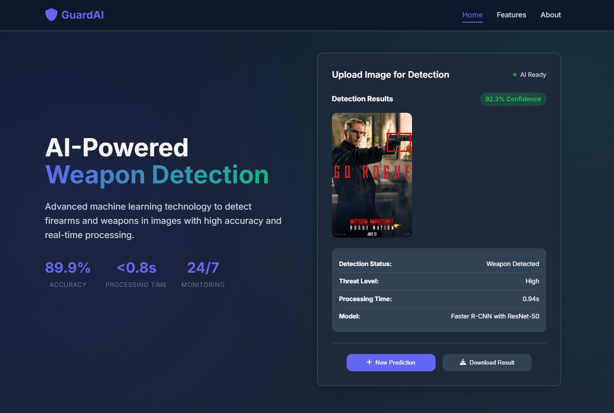

# 🔫 Guns Object Detection System - MLOPs

[](https://python.org)
[](https://pytorch.org)
[](https://fastapi.tiangolo.com)
[](LICENSE)

An end-to-end **Machine Learning Operations (MLOPs)** system for detecting guns and weapons in images using **Faster R-CNN** deep learning model. This project provides a complete pipeline from data ingestion to model deployment with a beautiful web interface.

## 🎯 Project Overview

This system uses state-of-the-art computer vision techniques to detect firearms in images, making it suitable for security applications, surveillance systems, and safety monitoring. The project follows MLOPs best practices with automated pipelines, experiment tracking, and containerized deployment.



### Key Features

- 🧠 **Deep Learning Model**: Faster R-CNN with ResNet-50 backbone
- 🌐 **Web Interface**: Modern, responsive web application
- 🔄 **MLOPs Pipeline**: DVC for experiment tracking and reproducibility  
- 🐳 **Containerized**: Docker support for easy deployment
- 📊 **Monitoring**: TensorBoard integration for training visualization
- ⚡ **Fast API**: RESTful API with automatic documentation
- 📱 **Real-time Detection**: Upload and analyze images instantly

## 🚀 Quick Start

### Prerequisites

- Python 3.9 or higher
- CUDA-compatible GPU (optional, for faster training)
- Git
- Docker (optional, for containerized deployment)

### Installation

1. **Clone the repository**
   ```bash
   git clone https://github.com/Kabyik-Kayal/Guns-Object-Detection-System-MLOPs.git
   cd Guns-Object-Detection-System-MLOPs
   ```

2. **Create virtual environment**
   ```bash
   python -m venv venv
   source venv/bin/activate  # On Windows: venv\Scripts\activate
   ```

3. **Install dependencies**
   ```bash
   pip install -r requirements.txt
   ```

4. **Install the package**
   ```bash
   pip install -e .
   ```

### Running the Application

#### Option 1: Using the Run Script
```bash
python run_server.py
```

#### Option 2: Using Uvicorn Directly
```bash
uvicorn main:app --host 0.0.0.0 --port 8000 --reload
```

Then open your browser and go to: **http://localhost:8000**

## 📊 MLOPs Pipeline

### Data Pipeline (DVC)

The project uses **Data Version Control (DVC)** for reproducible ML pipelines:

```bash
# Run the complete pipeline
dvc repro

# Run specific stages
dvc repro data_ingestion    # Download and prepare data
dvc repro model_training    # Train the model
```

### Pipeline Stages

1. **Data Ingestion**: Downloads gun detection dataset from Kaggle
2. **Model Training**: Trains Faster R-CNN model with experiment tracking

## 🏗️ Project Structure

```
├── 📁 artifacts/              # Generated artifacts
│   ├── models/               # Trained models
│   └── raw/                  # Raw dataset
├── 📁 config/                # Configuration files
├── 📁 src/                   # Source code
│   ├── data_ingestion.py     # Data download and preprocessing
│   ├── data_processing.py    # Dataset class and transformations
│   ├── model_architecture.py # Faster R-CNN model definition
│   ├── model_training.py     # Training pipeline
│   ├── logger.py            # Logging configuration
│   └── custom_exception.py  # Custom exception handling
├── 📁 static/               # Web interface files
│   ├── index.html           # Main web page
│   ├── css/style.css        # Styling
│   └── js/script.js         # Frontend logic
├── 📁 logs/                 # Application logs
├── 📁 tensorboard_logs/     # TensorBoard experiment logs
├── 📄 main.py               # FastAPI application
├── 📄 run_server.py         # Server startup script
├── 📄 dvc.yaml              # DVC pipeline definition
├── 📄 Dockerfile           # Container configuration
└── 📄 requirements.txt     # Python dependencies
```

## 🔧 Usage

### Web Interface

1. Start the server using `python run_server.py`
2. Open http://localhost:8000 in your browser
3. Drag and drop an image or click to upload
4. View the detection results with bounding boxes

### API Endpoints

- **GET /** - Web interface
- **POST /predict/** - Upload image for detection

### Example API Usage

```python
import requests

# Upload image for detection
with open('test_image.jpg', 'rb') as f:
    response = requests.post(
        'http://localhost:8000/predict/',
        files={'file': f}
    )
    
# Save the result image
with open('result.png', 'wb') as f:
    f.write(response.content)
```

## 🤖 Model Details

### Architecture
- **Base Model**: Faster R-CNN with ResNet-50 backbone
- **Framework**: PyTorch with TorchVision
- **Classes**: 2 (background, gun)
- **Input**: RGB images of any size
- **Output**: Bounding boxes with confidence scores

### Training Configuration
- **Optimizer**: Adam
- **Learning Rate**: 0.001
- **Batch Size**: 3 (adjustable based on GPU memory)
- **Epochs**: 30
- **Device**: Auto-detection (CUDA/CPU)

### Performance
- **Confidence Threshold**: 0.7 (70%)
- **Real-time Inference**: ~100-500ms per image (GPU)
- **Model Size**: ~160MB

## 📈 Experiment Tracking

### TensorBoard
View training metrics and logs:
```bash
tensorboard --logdir=tensorboard_logs
```

### DVC Metrics
Track experiments and compare model performance:
```bash
dvc metrics show
dvc plots show
```

## 🐳 Docker Deployment

### Build the Container
```bash
docker build -t guns-detection .
```

### Run the Container
```bash
docker run -p 8000:8000 guns-detection
```

## 🛠️ Development

### Training a New Model

1. **Prepare your dataset** in the artifacts/raw directory
2. **Configure training parameters** in the source files
3. **Run training**:
   ```bash
   python src/model_training.py
   ```

### Adding New Features

1. Fork the repository
2. Create a feature branch
3. Make your changes
4. Add tests if applicable
5. Submit a pull request

## 📚 Dependencies

### Core Dependencies
- **PyTorch & TorchVision**: Deep learning framework
- **FastAPI**: Web framework for API
- **OpenCV**: Image processing
- **Pillow**: Image handling
- **NumPy**: Numerical computations

### MLOPs Tools
- **DVC**: Data version control and pipelines
- **TensorBoard**: Experiment tracking
- **Uvicorn**: ASGI server

### Development Tools
- **Kaggle**: Dataset download
- **Git**: Version control

## 🤝 Contributing

We welcome contributions! Please see our contributing guidelines:

1. Fork the project
2. Create your feature branch (`git checkout -b feature/AmazingFeature`)
3. Commit your changes (`git commit -m 'Add some AmazingFeature'`)
4. Push to the branch (`git push origin feature/AmazingFeature`)
5. Open a Pull Request

## 📝 License

This project is licensed under the MIT License - see the [LICENSE](LICENSE) file for details.

## 🙏 Acknowledgments

- **Dataset**: Thanks to [issaisasank](https://www.kaggle.com/issaisasank) for the guns detection dataset
- **Tutorial**: Thanks to Sudhanshu Gussain for the comprehensive Tutorial of the project

## 🚨 Disclaimer

This system is designed for educational and research purposes.

**Made with ❤️ for Neural Networks**